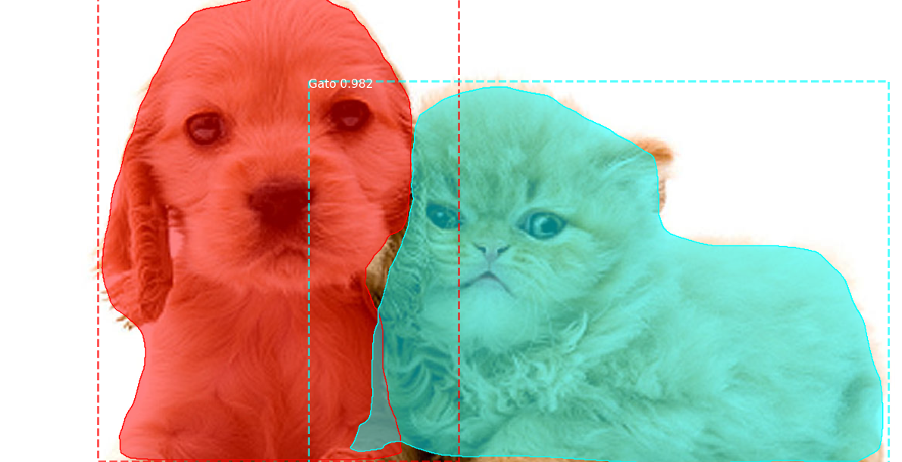
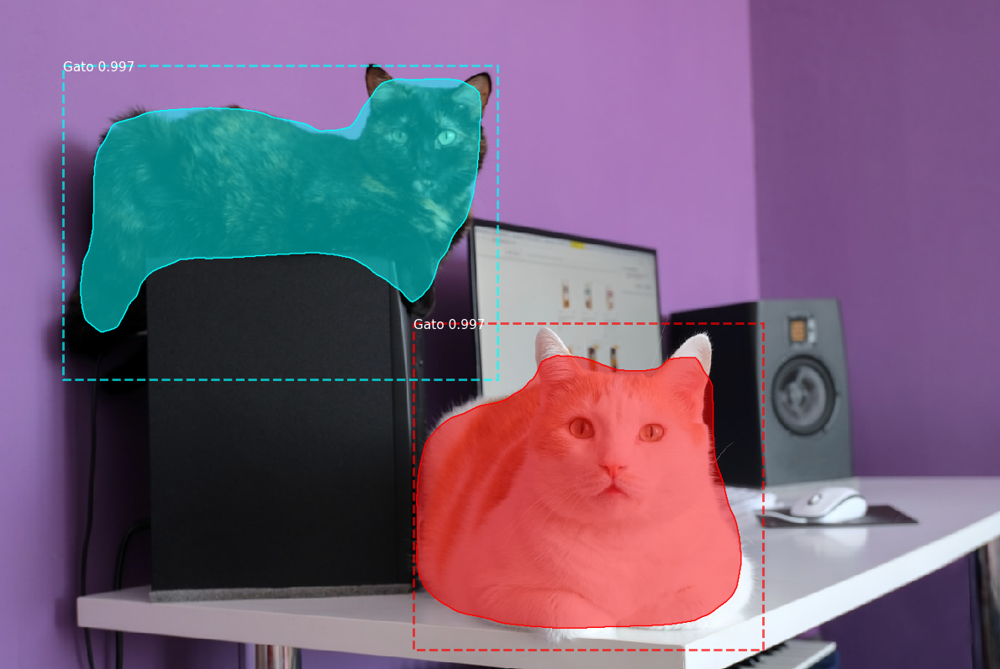
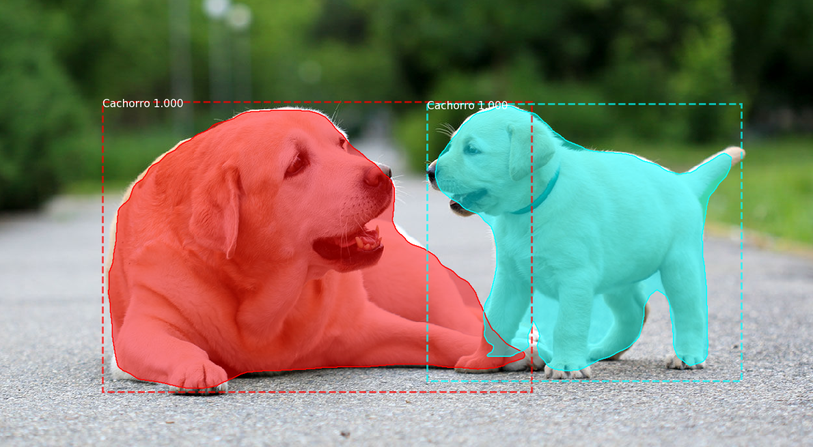
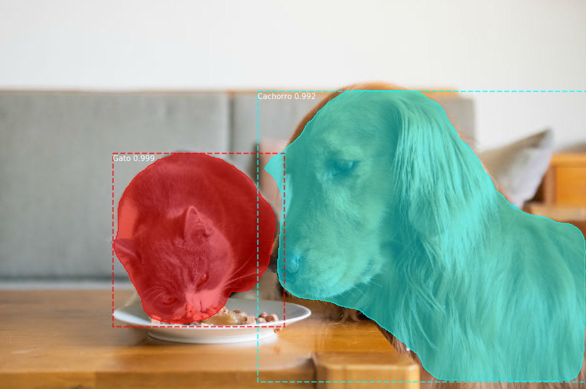
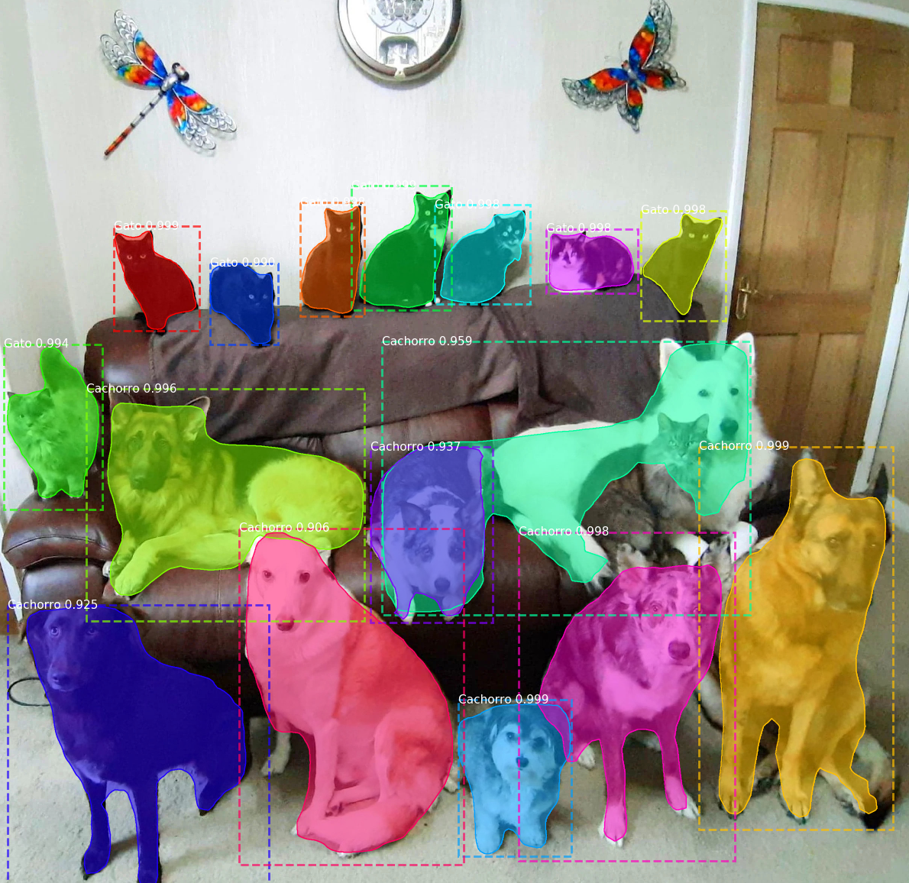
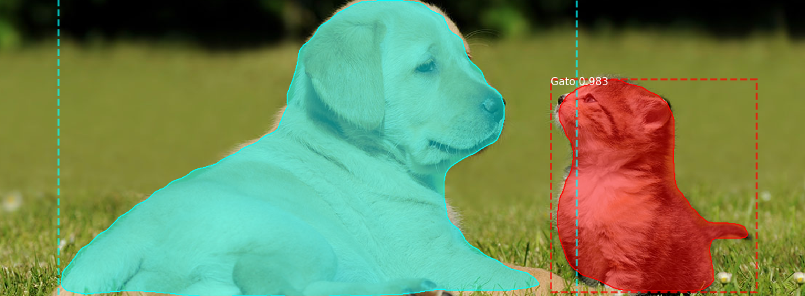

# Mask R-CNN para detectar Gatos e Cachorros em imagens

**Instalação**

Requer _Python 3.5_ ou superior

Instale os requerimentos e Mask R-CNN:
```
pip install -r requirements.txt
pip install setup.py build_ext install
```

**Utilização**

Chame o arquivo GatoCachorro.py passando o local e nome da imagem para o argumento --imagem
```
python GatoCachorro.py --imagem exemplo.jpg
```

**Exemplos**








**Desenvolvedor**

Giovanni Lucas - giovannilucasmoura@gmail.com
